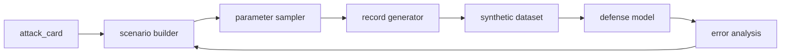

# Generator Design

This document describes how the synthetic attack generator should work.

The generator is responsible for converting a structured `attack_card` into one or more realistic synthetic payment scenarios and then into record-level data.

## Core idea

The generator should work in three stages:

1. Select an attack pattern from the catalog.
2. Instantiate a scenario with realistic parameters.
3. Emit transaction and context records that match the scenario.

This gives us a flexible system that can create many variants of the same fraud family without becoming repetitive.

## High-level pipeline



## Design goals

- Produce believable synthetic payment data.
- Preserve relationships between entities.
- Support both benign and fraudulent examples.
- Support both single events and multi-step campaigns.
- Allow controlled variation across attack intensity and stealth.
- Keep generation deterministic when seeded.

## Generator architecture

The generator should be split into four logical components:

### 1. Attack selector

Purpose:

- Choose which attack card to simulate.

Inputs:

- attack catalog
- generation weights
- evaluation priorities

Outputs:

- selected `attack_card`
- selection metadata

### 2. Scenario builder

Purpose:

- Convert a selected attack card into a concrete scenario.

This stage fills in details such as:

- which synthetic customer is targeted,
- which merchant or payment flow is involved,
- when the event occurs,
- how stealthy the attack should be,
- how many steps the campaign contains.

### 3. Parameter sampler

Purpose:

- Sample concrete values within the constraints of the scenario.

Examples:

- amount ranges
- time gaps between events
- device churn probability
- retry rates
- geographic mismatch likelihood
- refund timing

### 4. Record generator

Purpose:

- Emit the actual transaction rows and linked context records.

This component should generate:

- transaction records
- user profile records
- merchant profile records
- device session records
- attack instance metadata

## Generation modes

The schema already allows multiple generation modes.

### Template plus sampling

This is the recommended default.

How it works:

- use a predefined scenario template,
- fill in values by sampling from realistic distributions,
- apply constraints so the output remains plausible.

Why it is useful:

- easy to control,
- easy to debug,
- easy to explain in the write-up.

### Rules based

How it works:

- generate data from deterministic rules and thresholds.

Why it is useful:

- good for simple baselines,
- useful when you want fully explicit behavior.

### Agent based

How it works:

- use a planning agent or scripted agent to simulate attacker behavior over time.

Why it is useful:

- better for multi-step campaigns,
- better for social engineering and interaction-heavy fraud.

### Hybrid

How it works:

- use templates for structure,
- sampling for realism,
- agent logic for multi-step behaviors.

Why it is useful:

- likely the best long-term design for this challenge.

## Controlled overlap and hard negatives

The implemented generator has two fidelity profiles. `overlap` is the default and should be used for meaningful model evaluation. It creates deliberately difficult examples on both sides of the label boundary:

- atypical but legitimate payments: occasional high-value purchases, shipping/billing mismatch, and soft declines;
- stealth fraud: reduced geographic mismatch probability, mature-looking customer/merchant/device profiles, and an upstream risk score that overlaps legitimate activity;
- overt fraud: stronger behavioral divergence for coverage of clear attack cases.

These segments are retained only as `simulation_segment` provenance. They never become ML input features, preventing the model from learning the generator's label directly.

## Scenario object

The intermediate scenario should sit between the attack card and the final records.

Example scenario fields:

```json
{
  "scenario_id": "scn_001",
  "attack_id": "cred_cnp_001",
  "bucket": "credential_based_fraud",
  "subtype": "card_not_present",
  "stealth_level": 0.63,
  "attack_intensity": 0.71,
  "target_customer_id": "cust_123",
  "target_merchant_id": "m_456",
  "time_window_hours": 6,
  "event_count": 12,
  "seed": 42
}
```

Why this matters:

- it separates planning from rendering,
- it makes generation easier to test,
- it gives the evaluation layer a clean unit to compare.

## Scenario parameters

The scenario builder should infer or sample these values:

- `stealth_level`
- `attack_intensity`
- `event_count`
- `time_window`
- `target_profile`
- `merchant_profile`
- `device_stability`
- `geographic_consistency`
- `payment_method_mix`

These parameters should be constrained by the selected attack card.

For example:

- card testing should have a high retry rate and very small amounts,
- account takeover should show identity and device drift,
- refund abuse should show post-purchase timing and support interaction,
- merchant abuse should show lifecycle and payout patterns.

## Record generation approach

The record generator should fill the schema from the synthetic data model.

Recommended sequence:

1. Generate baseline benign populations.
2. Generate entities and histories for the selected scenario.
3. Inject attack behavior into the relevant records.
4. Validate that the results remain internally consistent.
5. Write final labeled outputs.

## Distribution design

The generator should use realistic distributions for fields such as:

- transaction amounts
- time between events
- number of attempts
- country distributions
- device reuse rates
- merchant category frequencies

Best practice:

- learn or approximate distributions from available reference data if any exists,
- otherwise use reasonable synthetic priors and document them.

## Implemented campaign timelines

Campaign events are no longer emitted at uniform intervals. Each scenario samples ordered, irregular event offsets inside its `time_window_hours`, while retaining deterministic replay from the seed. Runtime mutation overlays can set `time_window_multiplier`; this lets an accepted low-and-slow variant reduce volume while spreading its activity across a longer window.

The generator preserves the scenario timeline in `attack_instances.csv` through `time_window_hours`. This supports auditability and lets future sequence models replay the same campaign exactly.

## Realism controls

The generator should expose the following knobs:

- `attack_intensity`
- `stealth_level`
- `noise_level`
- `variant_diversity`
- `campaign_length`
- `event_density`

Interpretation:

- higher stealth means closer resemblance to legitimate behavior,
- higher intensity means more events or stronger abnormality,
- higher noise means more variability and harder detection.

## Validation layer

Every generated record should pass through validation checks.

Recommended checks:

- required fields present
- timestamps are ordered correctly
- amounts are positive and plausible
- linked entity IDs exist
- country and merchant values are consistent
- labels and attack metadata are aligned

If validation fails, the generator should either:

- repair the record,
- regenerate it,
- or reject it.

## Reproducibility

Each generated scenario should be reproducible.

Recommended metadata:

- `scenario_seed`
- `attack_id`
- `generator_version`
- `generation_timestamp`

This makes debugging and evaluation much easier.

## Output artifacts

The generator should output:

- synthetic transaction dataset
- entity tables
- attack instance metadata
- generation logs
- validation report

## Why the generator design matters

This is the bridge between fraud knowledge and training data.

- Without a clean scenario layer, generation becomes brittle.
- Without validation, realism suffers.
- Without reproducibility, evaluation becomes hard to trust.

This design keeps the system explainable, testable, and extensible.
